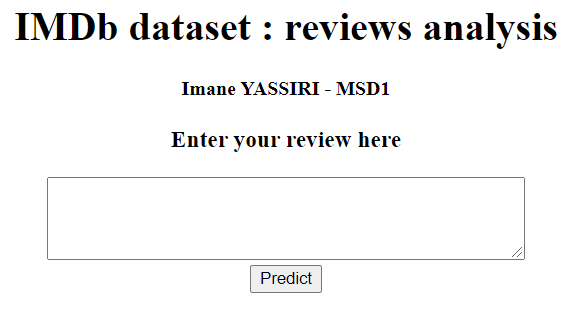
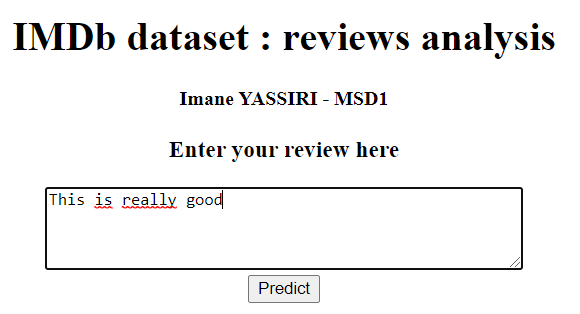
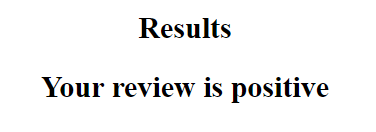

# Sentiment Analysis: IMDb movie reviews dataset

## Table of contents
* [General info](#general-info)
* [Demo](#demo)
* [Technologies](#technologies)

## General info
This project is a Flask application. The application predicts whether or not a review is positive, based on an IMDb movie reviews dataset.
For more information, you can find the dataset here : [imdb-dataset-of-50k-movie-reviews](https://www.kaggle.com/lakshmi25npathi/imdb-dataset-of-50k-movie-reviews).
You can also see the NLP and classification work that I did by opening the _IMDB Dataset of 50K Movie Reviews - Imane YASSIRI - MSD1.ipynb_ file.

## Demo

## Technologies
This project is created with:
* Python 3.8.8
* Flask 2.0.1
	
